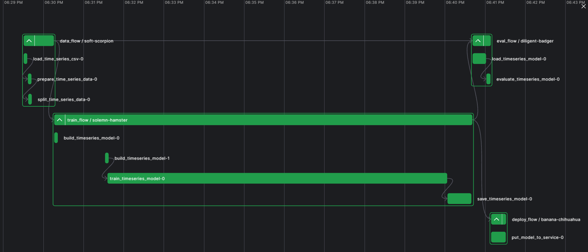
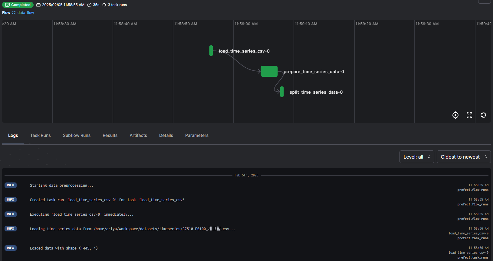
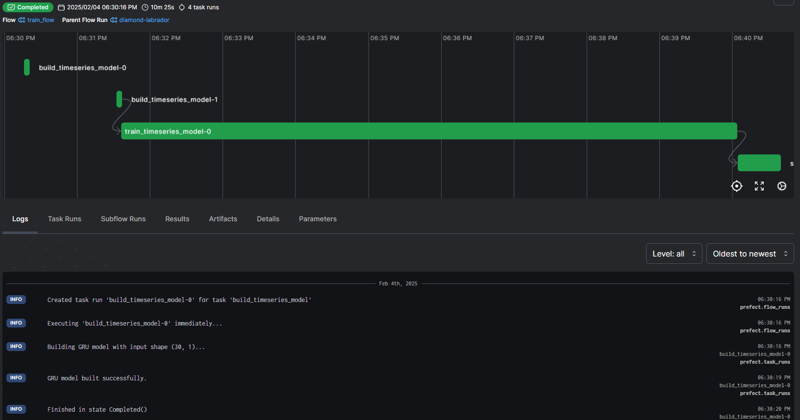
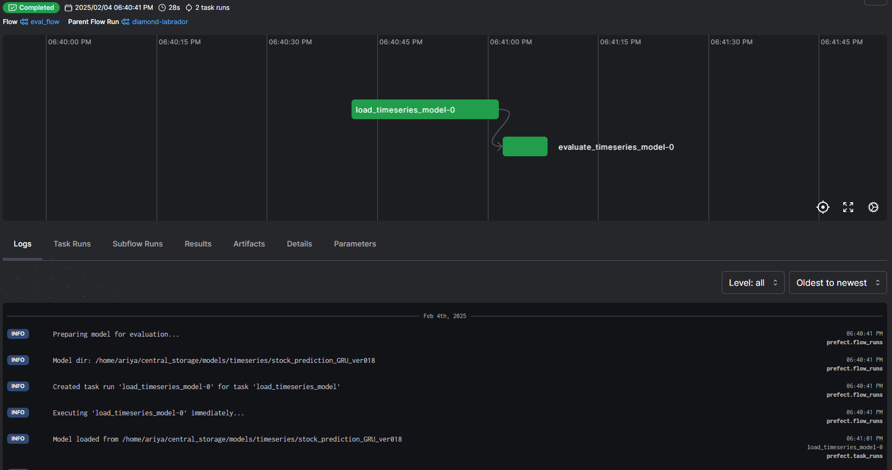
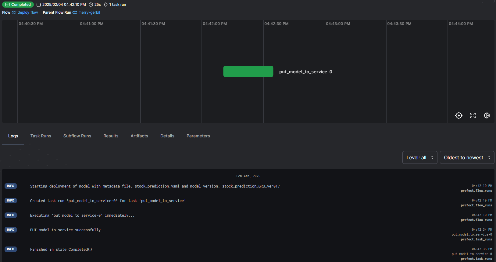

<h1 align="center"> Customizing MLOps On-Premise End to End Open-Source Project </h1>


# Table of contents
- [Overview](#overview)
- [Tasks](#tasks)
- [Flows](#flows)
- [Services](#services)
- [API Endpoint](#api-endpoint)


## Overview

### 코드 프로젝트 시행 방법
```
   cd mlops-backend

   docker-compose up --build

```

### Customization Process (모델 추가, Tasks-Flows 수정 등등)

- **Step 1**: MLOps 플랫폼의 Tasks, 예를 들어 데이터 처리 (dataset.py), 모델 학습 구축 (ai_models/), 모델 배포 (deploy.py) 등이 "/task" 폴더에 정의되어 있다.
- **Step 2**: 정의된 Tasks는 "/flows" 폴더에 있는 각 플로우(data_flow, train_flow, eval_flow, deploy_flow, full_flow)에서 호출된다.
플로우에서 사용되는 변수들은 "/configs" 폴더 내의 설정 파일에 정의되어 있다.
- **Step 3**: 플로우는 workspace에 있는 "run_flow.py" 파일을 통해 호출되고 실행된다. 이 파일은 Jupyter Notebook의 터미널에서 직접 실행할 수 있다.
또한 "api_flow.py" 파일에 POST API가 구축되어 있어 플로우를 실행할 수 있다.
- **Step 4**: 처리된 데이터는 "/datasets" 폴더에 저장되어 관리되고 사용된다.
- **Step 5**: "home/ariya/central_storage"에 있는 central_storage 폴더는 모델을 저장하고 평가 및 배포에 사용된다 (클라우드 서비스로 확장 가능).

## Tasks 

### MLOps 작업들 tasks 폴더에 정의됨
Tasks는 flows 폴더에 있는 각각의 flow에서 호출되며, 모델 학습습, 평가, 배포 프로세스를 자동화하는 데 사용됨.

1.**데이터 처리** - dataset.py
- 이미지와 시계열 데이터 로드 및 전처리를 위한 함수들이 정의됨. 예를 들어, 이미지를 위한 load_data()와 시계열 데이터를 위한 load_time_series() 함수.

2.**AI 모델** - /ai_models/image_model.py와 timeseries_models.py
- 이미지 모델(image_model.py): 새로운 모델을 추가하려면, image_model.py에 모델 코드를 추가하거나 생성해야 함. 이에는 새로운 모델을 구축하거나(예: CNN, ResNet 등), 기존 모델을 재사용하는 것이 포함될 수 있음.
- 시계열 데이터 모델(timeseries_models.py): 새로운 모델이 시계열 데이터(예: LSTM, BiLSTM 등)용이라면, timeseries_models.py에 모델을 생성해야 함.
- dataset.py 파일에서는 추가할 모델에 맞는 데이터를 처리하는 새로운 함수들을 추가해야 함.

3.**모델 배포** - deploy.py
- 학습된 모델을 프로덕션 환경에 배포하는 작업들이 정의됨. 예를 들어, put_model_to_service() 함수는 모델을 서비스로 배포하는 역할.


## Flows

MLOps의 플로우는 데이터 처리, 모델 훈련, 평가 및 배포와 같은 작업을 조정하는 역할을 함. 플로우는 flows 폴더에 정의되며, 각 플로우는 고유한 작업을 수행함:

1.**데이터 플로우 (data_flow.py):**
- 입력 데이터를 처리하고, 데이터를 로드하고 전처리하며 훈련, 검증, 테스트 데이터셋으로 분할함. 
- 이 플로우에 대한 설정은 configs/data_flow_config.yaml에 있음.

2.**학습 플로우 (train_flow.py):** 
- 처리된 데이터를 사용하여 모델을 훈련시키고, 훈련 후 모델과 메타데이터를 저장함. 
- 이 플로우의 설정은 configs/train_flow_config.yaml에 있음.

3.**평가 플로우 (eval_flow.py):**
- 학습된 모델을 평가하고, 테스트 데이터셋을 기준으로 성능을 측정하여 결과를 저장함. 
- 설정은 configs/eval_flow_config.yaml에 제공됨.

4.**배포 플로우 (deploy_flow.py):** 
- 학습된 모델을 생산 환경에 배포함. 
- 배포에 대한 매개변수는 configs/deploy_flow_config.yaml에 있음.

5.**전체 플로우 (full_flow.py)**
- 위의 모든 플로우를 하나의 전체 프로세스로 결합하여 데이터 처리, 훈련, 평가, 배포 과정을 순차적으로 실행함.
- 모든 플로우의의 매개변수는 configs/full_flow_config.yaml에 있음.


### Flows Run
- 플로우들은 run_flow.py 파일을 통해 호출되어 실행됨. 플로우는 Jupyter Notebook에서 터미널 직접 실행할 수 있음.
- run_flow.py는 또한 API를 통해 실행할 수 있음. api_flow.py에 정의된 POST API를 통해 플로우를 트리거하고, 이를 웹 서비스나 다른 시스템에서 호출할 수 있음. 이를 통해 플로우를 자동화하거나 외부 시스템과 통합하여 실행할 수 있음.
- API Endpoint: api_flow.py에서 정의된 API를 통해 플로우를 호출할 수 있음
   + @app.post("/run_flow/{flow_type}"), flow_type = "data_flow", "train_flow", "eval_flow", "deploy_flow", "full_flow"
- 다음음 그림림는 Prefect 서버에서 흐름 실행을 실시간으로 모니터링하는 화면이이다. 이를 통해 흐름이 실행되는 상태와 진행 상황을 추적할 수 있으며, 실행 중 발생하는 문제를 쉽게 발견하고 처리할 수 있다.
- Prefect Server address: http://192.168.219.52:4200/

*Figure: Real-time monitoring of full flow runs on Prefect Server*

|  |  |
|-----------------------|-----------------------|
| *Figure 1: Data-Flow monitoring* | *Figure 2: Train-Flow monitoring* |
|  |  |
| *Figure 3: Evaluate-Flow monitoring* | *Figure 4: Deploy-Flow monitoring* |


## Services

### MLOps Services Structure
```
   services/
   ├── dl_service/
   │   ├── app/
   │   ├── Dockerfile
   │   ├── requirements.txt
   ├── evidently/
   │   ├── Dockerfile
   │   ├── requirements.txt
   ├── grafana/
   │   ├── dashboards/
   │   ├── grafana_datasources.yml
   │   ├── grafana_dashboards.yml
   │   ├── Dockerfile
   │   ├── requirements.txt
   ├── jupyter/
   │   ├── Dockerfile
   │   ├── requirements.txt
   ├── mlflow/
   │   ├── Dockerfile
   │   ├── requirements.txt
   ├── nginx/
   │   ├── default.conf.template
   │   ├── Dockerfile
   ├── postgres/
   │   ├── docker_postgres_init.sql
   │   ├── Dockerfile
   ├── prefect/
   │   ├── Dockerfile
   │   ├── requirements.txt
   ├── prefect_worker/
   │   ├── Dockerfile
   │   ├── requirements.txt
   ├── prometheus/
   │   ├── prometheus.yml
   ├── web_ui/
   │   ├── app/
   │   ├── Dockerfile
   │   ├── requirements.txt
   └── README.md
```
#### Key Points and Service Ports:
- **LOCAL MACHINE HOST: 192.168.219.52**
1. **dl_service** (Port: 4242): Handles model deployment and inference. (Port: 4242)
2. **mlflow** (Port: 5050): Tracks experiments and manages models.
3. **jupyter** (Port: 8888): Provides an interactive notebook for data exploration and model development.
4. **nginx** (Port: 80): Acts as a reverse proxy and load balancer.
5. **pgAdmin** (Port: 16543 - user: pgadmin@gmail.com, pw: SuperSecurePwdHere): Access to DB Server
                **DB 정보보**
                ```
                POSTGRES_USER=postgres
                POSTGRES_PASSWORD=postgres
                POSTGRES_DB=postgres
                ```
6. **prefect server** (Port: 4200): Orchestrates and schedules machine learning task flows.
7. **postgres** (Port: 5432): Stores metadata for models and experiments.
8. **web_ui** (Port: 4243): Frontend interface for the system.


## **MLOPS API ENDPOINT 정의의**

### Run Flow EndPoint: 
**API 1 Guide: http://192.168.219.52:8686/docs#/**

**1. Run FLow Action API:**
#### @app.post("/api/run_flow/{flow_type}", tags=["Run Flows"])
- API 주소: http://192.168.219.52:8686/api/run_flow/{flow_type}
**Flow Types:**
- flow_type이 full_flow인 경우, run_full_flow() 함수가 백그라운드에서 실행됩니다.
- flow_type이 train_flow인 경우, run_train_flow() 함수가 실행됩니다.
- flow_type이 eval_flow인 경우, run_eval_flow() 함수가 실행됩니다.
- data_flow와 deploy_flow에 대해서도 마찬가지입니다.

**API 조정 사항:**
- run_full_flow와 run_train_flow의 경우: model_type은 "LSTM", "GRU", "BiLSTM", "Conv1D-BiLSTM", 또는 "auto" (AutoML용) 중 하나로 제한되어야 합니다.
- 나머지 flow 유형들 (run_eval_flow, run_data_flow, run_deploy_flow)의 경우: model_type은 "0"으로 설정할 수 있으며, epochs는 이들 flow와 관련이 없으므로 어떤 정수도 가능합니다.
- 이러한 run_flow 명령어를 실행하면 해당 flow의 작업이 Prefect 서버에서 실행되고 모니터링됩니다.

**2. Running FLow Monitoring:**
#### @app.get("/api/flow-monitoring-data", tags=["Monitoring Flows"])
- API 주소: http://192.168.219.52:8686/api/flow-monitoring-data
- 이 API는 Prefect 서버에서 실행 중이거나 완료된 "flow" (작업 흐름)와 "task" (작업)에 대한 모니터링 정보를 제공합니다. 아래는 API의 구조와 기능에 대한 자세한 설명입니다.

**API Response**
1. flow_info:
- 실행 중인 흐름 목록을 포함합니다:
- flow_id: 흐름의 고유 ID.
- flow_name: 흐름의 이름.
- flow_run_name: 흐름 실행의 이름.
- state: 흐름의 상태 (예: COMPLETED, RUNNING).
- start_time 및 end_time: 흐름의 시작 및 종료 시간.
- tasks: 흐름과 관련된 작업들의 목록, 각 작업의 이름, 상태 및 시작 및 종료 시간 포함.

2. graph:
- 차트 도구(예: Plotly)를 위한 데이터 형식인 scatter 형태입니다. 각 라인은 하나의 흐름을
- 나타내며 시작 및 종료 시간, 흐름 이름, 상태, 그리고 추가적인 세부 정보를 포함합니다.
- 각 흐름은 시작 시간부터 종료 시간까지의 시간선(x)을 나타내는 차트 부분을 가집니다.
- 흐름의 종료 시간에 상태(COMPLETED 등)를 나타내는 마커가 표시됩니다.

3. layout:
- 차트의 레이아웃을 설정합니다:
- title: 차트의 제목.
- xaxis: 시간 축을 설정하며, 데이터 유형은 date입니다.
- yaxis: 흐름 이름을 표시하는 Y축을 설정합니다.
- height 및 width: 차트의 크기.
- margin: 차트의 여백을 설정하여 제목과 내용에 맞게 조정합니다.

**Note**

- 이 API의 응답을 사용하여 실시간으로 flow run을 시간대별로 추적하는 그래프를 그릴 수 있습니다. 위 이미지와 같이, 각 flow의 상태(예: RUNNING, COMPLETED)를 시간 축을 따라 표시하고, 각 flow가 수행되는 동안의 상태 변화도 표시됩니다.

- 이를 위해 필요한 데이터는 주로 flow_info에서 각 flow의 시작 시간과 종료 시간, 상태를 추출하고, graph 데이터를 이용하여 차트를 그리는 데 활용됩니다. 각 흐름은 하나의 라인으로 표시되며, 종료 시간에 해당하는 마커를 통해 상태를 시각적으로 나타낼 수 있습니다.


*Please check sampling UI in: http://192.168.219.52:4243/flow-monitoring*

- Prefect UI에 접속하여 http://192.168.219.52:4200/에서 플로우의 활동과 활동 기록을 확인할 수 있습니다. 또한, 플로우에 대한 다른 정보가 필요하면 Prefect API를 사용할 수 있습니다 (자세한 API 내용은 http://192.168.219.52:4200/docs에서 확인 가능)


**API 2 Guide: http://192.168.219.52:4242/docs#/**

**1. Deploy AI model and predict in UI:**
#### @app.post('/predict_timeseries', response_model=PredictionTimeSeriesResult, responses={404: {"model": PredictionTimeSeriesResult}}, tags=["Prediction UI"])
- API 주소: http://192.168.219.52:4242/predict_timeseries
- 이 API는 제품의 재고 예측을 수행하는 엔드포인트입니다. 주어진 재고 데이터를 바탕으로 향후 몇 일간의 재고를 예측합니다. 아래는 이 API의 상세 설명입니다

**요청 본문(Request Body)**

요청 본문은 예측을 위한 데이터와 예측할 일수를 포함합니다. 형식은 다음과 같습니다:
```
  "input_data": [43, 56, 46, ...], 
  "prediction_step": 0
```
- input_data: 이 값은 지난 30일 간의 제품 재고 데이터를 배열 형태로 입력받습니다. 예를 들어, [43, 56, 46, ...]처럼 각 일자의 재고량을 입력합니다.
- prediction_step: 예측할 미래 일수를 나타냅니다. 기본값은 7일 (1주일)로 설정되어 있습니다. 예를 들어, prediction_step: 7이면 향후 7일 간의 재고 예측을 요청하는 것입니다.

**응답(응답 본문)**
응답은 모델 이름과 예측된 재고 값 배열을 포함하는 구조로 반환됩니다. 형식은 다음과 같습니다:
```
  "model_name": "AI 모델 이름",
  "prediction": [23, 45, 56, 78, 78, 88, 45],
  "message": "예측 성공"
```
- model_name: 예측에 사용된 AI 모델의 이름을 반환합니다.
- prediction: 예측된 결과를 배열로 반환합니다. 예를 들어, 향후 7일간의 예측된 재고 값은 [23, 45, 56, 78, 78, 88, 45]와 같이 나타날 수 있습니다.
- message: 예측 작업의 상태 메시지입니다. 예를 들어, "예측 성공"이라는 메시지가 표시됩니다.


